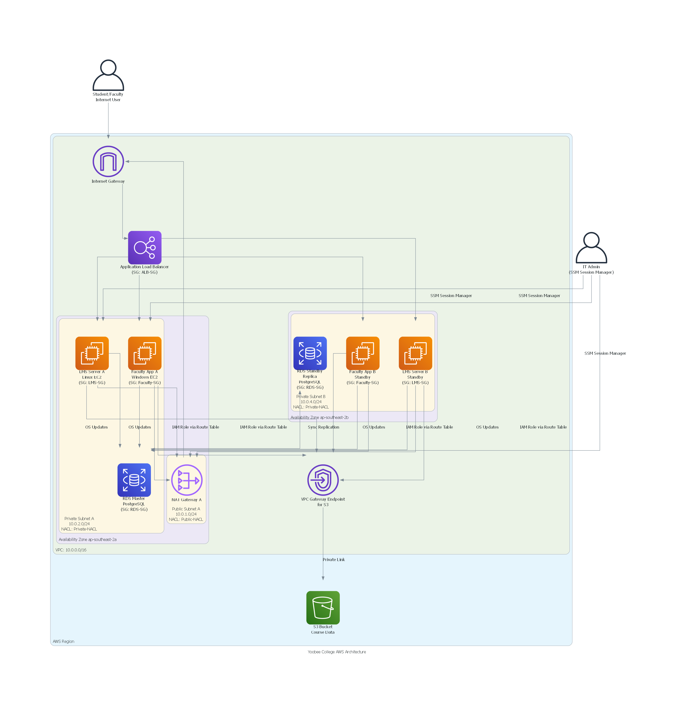

# Yoobee College AWS Architecture Project

> **Note:** This project is a learning exercise and a work in progress. The architecture and implementation details are for educational purposes and may not reflect a production-ready environment.

This repository contains the documentation for designing, implementing, and optimizing a cloud-based server virtualization infrastructure for Yoobee College using Amazon Web Services (AWS).

## Repository Contents

This project is structured into several key documents:

-   `Project_Execution_Plan.md`: The overarching plan for the project.
-   `Preparation_Guide.md`: Essential steps to prepare the AWS environment before implementation.
-   `Task2_Report_and_Diagram_Code.md`: Covers the theoretical design of the AWS architecture, service choices, security considerations, and the practical implementation of the foundational network infrastructure.
-   `Task3_Implementation_Guide.md`: A step-by-step practical guide for deploying core AWS services (EC2, S3, RDS, ALB).
-   `Task4_Implementation_Guide.md`: A guide for implementing security enhancements, CloudWatch monitoring, and theoretical cost optimization strategies.
-   `create_diagram.py`: A Python script to generate the AWS architecture diagram (`yoobee_college_aws_architecture.png`).

## Architecture Overview

This architecture incorporates several key AWS services and design patterns to create a secure, available, and manageable environment.

### Key Features & Design Patterns

*   **High Availability:**
    *   Resources are deployed across multiple Availability Zones (`ap-southeast-2a`, `ap-southeast-2b`) to ensure fault tolerance.
    *   A Multi-AZ deployment for Amazon RDS provides a standby database for automatic failover.
    *   An Application Load Balancer distributes traffic across instances in both zones.

*   **Security:**
    *   **Network Isolation:** Application servers and the database are located in private subnets, inaccessible directly from the public internet.
    *   **Secure Access:** Administrative access to EC2 instances is managed via AWS Systems Manager (SSM) Session Manager. This removes the need for bastion hosts, open SSH/RDP ports, and SSH key management.
    *   **Private S3 Connectivity:** A VPC Gateway Endpoint is used for EC2 instances to access Amazon S3, keeping traffic off the public internet.
    *   **Fine-Grained Permissions:** The design relies on specific Security Groups (`LMS-SG`, `Faculty-SG`, `ALB-SG`, `RDS-SG`) and IAM Roles to enforce the principle of least privilege.

*   **Operational Efficiency:**
    *   **Managed Services:** Utilizes managed services like Amazon RDS and Application Load Balancer to reduce operational overhead.
    *   **Centralized Outbound Traffic:** A NAT Gateway provides a managed path to the internet for private resources needing outbound access (e.g., for software updates).
## Architecture Diagram

## Why Choose SSM Session Manager?

AWS Systems Manager (SSM) Session Manager is widely recognized as a modern best practice for securely managing EC2 instances. The primary reasons for adopting it in this project's AWS architecture are as follows:

1.  **Enhanced Security**
    *   Eliminates the need for SSH key management and open ports.
    *   Enables access control through IAM policies, aligning with a zero-trust design.
    *   Supports logging and CloudTrail integration, ensuring high auditability.

2.  **Simplified Network Configuration**
    *   Removes the need for a Bastion Host, so there is no need to place a jump server in the Public Subnet.
    *   Allows direct access to EC2 instances in the Private Subnet, making the configuration simpler and more secure.

3.  **Cost Reduction**
    *   Reduces operational costs by eliminating the need for a Bastion Host and Elastic IPs.
    *   Allows for the reduction of security groups and NAT routes intended for SSH.

4.  **Strong Support for Reproducibility and Automation**
    *   IAM Roles and SSM policies can be defined as code using CloudFormation or Terraform.
    *   It integrates easily with Docker and CI/CD, making it ideal for configuration management in educational and public sector environments.

## Step-by-Step Guide to Completing the Project

Follow these steps to successfully complete the project and compile the final documentation.

1.  **Review All Guides**
    -   Thoroughly read all the markdown files listed above to understand the project scope, theoretical design, and practical implementation steps.

2.  **Prepare Your AWS Environment**
    -   Follow the instructions in `Preparation_Guide.md` to set up your AWS account and configure IAM users/MFA. This is a critical prerequisite.

3.  **Implement Core Architecture (Task 3)**
    -   Follow the detailed, step-by-step instructions in `Task3_Implementation_Guide.md` to deploy the EC2 instances, S3 bucket, RDS database, and Application Load Balancer (ALB).
    -   **Crucially, capture screenshots** of each significant step within the AWS console. These are essential for your final report.

4.  **Implement Optimization and Security (Task 4)**
    -   Follow `Task4_Implementation_Guide.md` to configure AWS CloudWatch monitoring and apply recommended security best practices.
    -   **Capture screenshots** of your CloudWatch setup and other relevant configurations.

5.  **Generate Architecture Diagram**
    -   Navigate to the `A2_result/diagram_script/` directory.
    -   Run the `create_diagram.py` Python script using the command: `python create_diagram.py`.
    -   This will generate the `yoobee_college_aws_architecture.png` diagram.

6.  **Compile Final Report in MS Word**
    -   Create a new MS Word document.
    -   Copy and paste the content from the following files in this order:
        1.  `Project_Execution_Plan.md`
        2.  `Preparation_Guide.md`
        3.  `Task2_Report_and_Diagram_Code.md`
        4.  `Task3_Implementation_Guide.md`
        5.  `Task4_Implementation_Guide.md`
    -   Insert the `yoobee_college_aws_architecture.png` diagram into the appropriate section.
    -   Integrate all your screenshots into the relevant implementation sections.
    -   Review the entire document for formatting, clarity, and completeness.

7.  **Final Review and PDF Conversion**
    -   Proofread your compiled document carefully.
    -   Save the final document as a PDF.

> **IMPORTANT: Final Cleanup**
> After completing your work, **strictly follow the cleanup steps** detailed in `Task3_Implementation_Guide.md` to delete all created AWS resources and avoid unnecessary charges.
